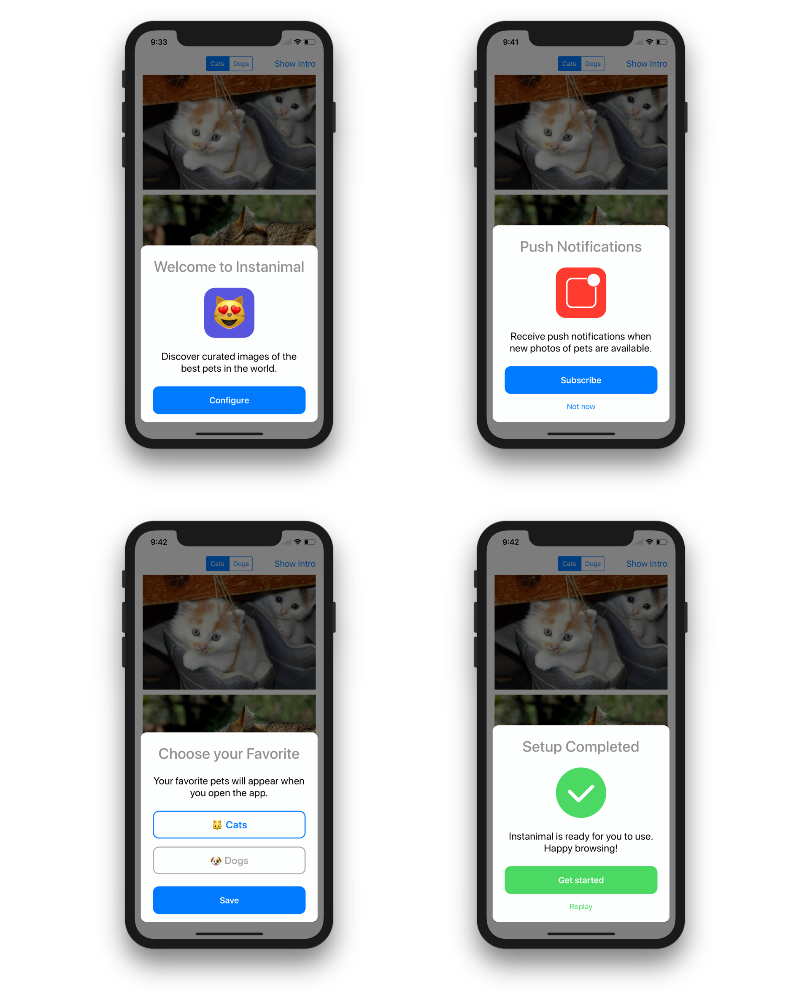
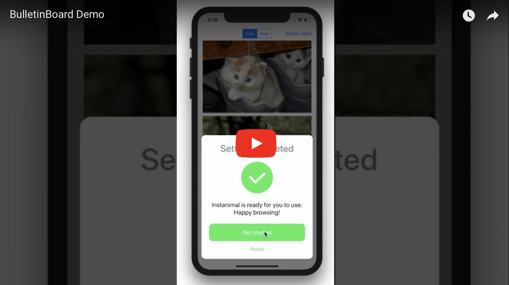
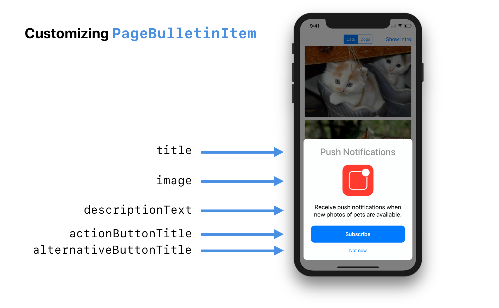
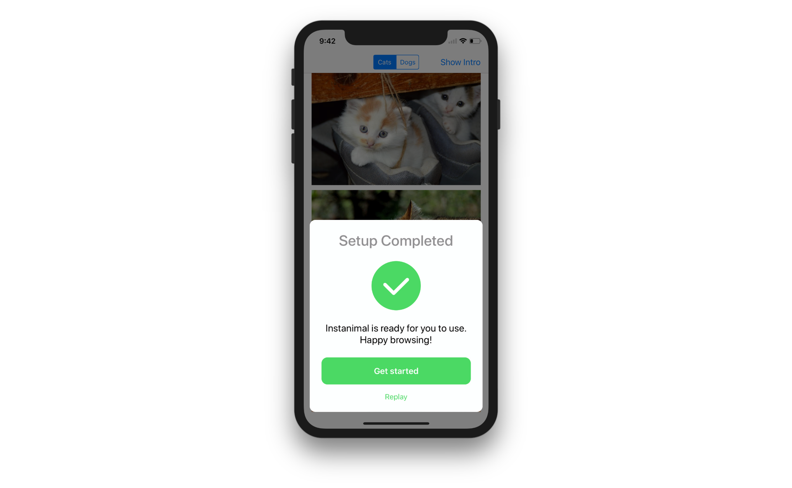
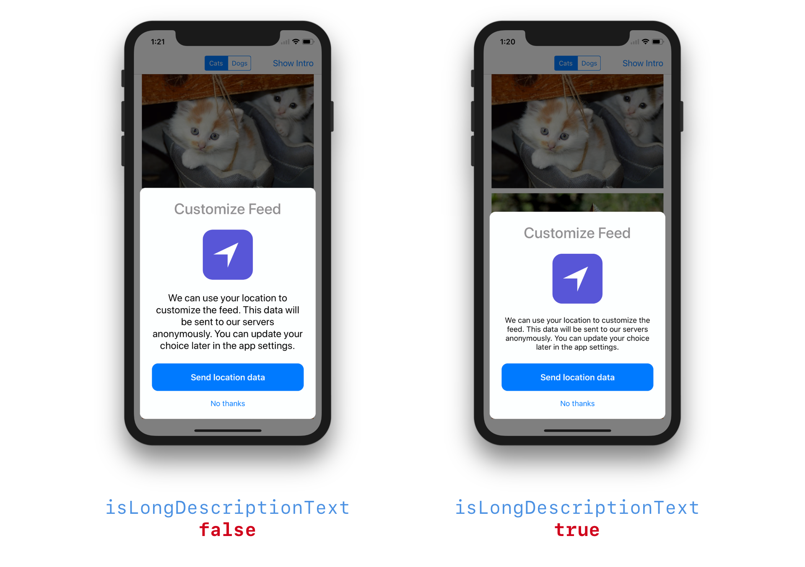
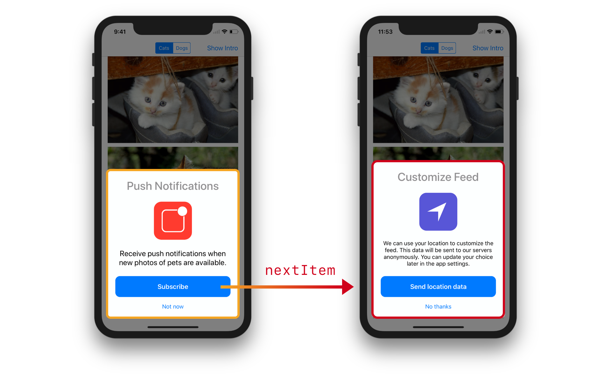

# BulletinBoard

BulletinBoard is an iOS library that generates and manages contextual cards displayed at the bottom of the screen. It is especially well suited for quick user interactions such as onboarding screens or configuration.

It has an interface similar to the cards displayed by iOS for AirPods, Apple TV configuration and NFC tag scanning,

Here are some screenshots showing what you can build with BulletinBoard:

## Requirements

- iOS 9 and later
- Swift 4

## Demo

A demo application is included in the `BulletinBoard` workspace. It demonstrates how to: 

- integrate the library (setup, data flow)
- create standard page cards
- create custom page subclasses to add features
- create custom cards from scratch

Build and run the `Instanimal` scheme to use it.

Here's a video showing it in action:

## Installation

BulletinBoard is available via CocoaPods and Carthage.

### CocoaPods

To install BulletinBoard using [CocoaPods](https://cocoapods.org), add this line to your `Podfile`:

~~~ruby
pod "BulletinBoard"
~~~

### Carthage

To install BulletinBoard using [Carthage](https://github.com/Carthage/Carthage), add this line to your `Cartfile`:

~~~
github "alexaubry/BulletinBoard"
~~~

## Usage

## The Basics

The `BulletinManager` class generates, manages and displays bulletin cards. Cards are created using bulletin items. Bulletin items are objects that conform to the `BulletinItem` protocol.

The library provides a standard item type: `PageBulletinItem`. If you need to customize the items, you can override this class, or create new item types from scratch.

## Displaying Bulletins

To display bulletins you first need to create the root item to display (explained in the next sections).

With this root item, you need to create a `BulletinManager`. We recommand to put it in the view controller that will display the bulletin.

~~~swift
class ViewController: UIViewController {

    lazy var bulletinManager: BulletinManager = {

        let rootItem: BulletinItem = // ... create your item here
        return BulletinManager(rootItem: rootItem)

    }()

}
~~~

To present your bulletin, call this method:

~~~swift
bulletinManager.prepare()
bulletinManager.presentBulletin(above: self)
~~~

Always call `prepare()` before calling `presentBulletin()`! Failure to do so will cause a precondition failure (TL;DR your app will crash).

For the case of onboarding, you can call it in `viewWillAppear(animated:)` after checking if the user has already completed onboarding.

## Creating Page Items

You can create standard page items using the `PageBulletinItem` class.

It takes care of generating a user interface with standard components:

- a title (required)
- an icon image (should be 100x100px or less)
- a description text
- a large action button
- a smaller alternative button

For example, this interface was created using a `PageBulletinItem`:

To recreate this interface, use this code:

~~~swift
let page = PageBulletinItem(title: "Push Notifications")
page.image = UIImage(named: "...")

page.descriptionText = "Receive push notifications when new photos of pets are available."
page.actionButtonTitle = "Subscribe"
page.alternativeButtonTitle = "Not now"
~~~

If you omit an optional property, the page won't generate a view for it. For instance, if you set `alternativeButtonTitle` to `nil`, the card won't display an alternative button.

### Customizing The Appearance

#### Colors

You can customize the colors on the page by using the `interfaceFactory` property.

This property references a `BulletinInterfaceFactory`, which is responsible for generating the standard components (more on this later).

There are two properties that you can change:

- `tintColor` - the tint color of the buttons (defaults to iOS blue)
- `actionButtonTitleColor` - the color of action button titles

You need to set these before you present / push the item. Changing them after presentation will have no effect.

**Example**

~~~swift
page.interfaceFactory.tintColor = UIColor(red: 0.294, green: 0.85, blue: 0.392, alpha: 1) // green
page.interfaceFactory.actionButtonTitleColor = .white
~~~

This produces a card with the following appearance:

#### Text Size

If the description text is long, you can set the `shouldCompactDescriptionText` property to `true` to reduce the text size.

This property is `false` by default.

### Handling Button Taps

To handle taps on buttons, set a closure for these properties:

- `actionHandler` - called when the action button is tapped.
- `alternativeHandler` - called when the alternative button is tapped.

~~~swift
page.actionHandler = { (item: PageBulletinItem) in
    print("Action button tapped")
}
~~~

This prints `"Action button tapped"` when the action button is tapped.

~~~swift
page.alternativeHandler = { (item: PageBulletinItem) in
    print("Alternative button tapped")
}
~~~

This prints `"Alternative button tapped"` when the alternative button is tapped.

Use these handlers as an opportunity to change the presented item, dismiss the bulletin and/or pass data to your model.

## Changing the Presented Item

The `BulletinItem` protocol exposes a `manager` property that is set when the item is currently being displayed by a manager.

You can use it to interact with the presented bulletin. Call:

- `manager?.popItem()` to go back to the previous item
- `manager?.popToRootItem()` to go back to the first item
- `manager?.push(item:)` with a `BulletinItem` to present a new item
- `manager?.dismissBulletin(animated:)` to dismiss the bulletin

You need to call these methods from the main thread. Never force unwrap `manager`, as this property will be unset as soon as the item is removed from the bulletin.

It is also possible to set the `nextItem` property to the `BulletinItem` that should be displayed next and call the `displayNextItem()` method when you want to display it.

For instance, to present a new card when the user taps the action button:

~~~swift
page.nextItem = makeLocationPage() // Creates a new PageBulletinItem

page.actionHandler = { (item: PageBulletinItem) in
    item.displayNextItem()
}
~~~

This creates the following interaction:

## Automatic Dismissal

If you set the `isDismissable` property to `true`, the user will be able to dismiss the bulletin by tapping outside of the card.

You should set this property to `true` for the last item.

## Creating Custom Items

To create custom bulletin items, create a class that implements the `BulletinItem`. To learn with a concrete example, you can read the implementation of `PageBulletinItem`.

### Conforming to BulletinItem

To conform to this protocol, you need to add the required properties and implement two methods:

#### `makeArrangedSubviews()`

This method should return all the elements to display on the card.

Please note that the `alpha` and `isHidden` properties will be ignored.

#### `tearDown()`

In this method, clear all the resources allocated for the item (such as notification observers or button targets). After this method is called, the `manager` will be set to `nil` and the arranged subviews will be hidden and removed from the card.

### Generating Standard Views

Even though you are creating a custom card, you may still want to display some standard elements, such as title labels or action buttons.

To generate standard elements, use the methods of `BulletinInterfaceFactory`:

- `makeTitleLabel()` to create a title label
- `makeDescriptionLabel(isCompact:)` to create a description label
- `makeActionButton(title:)` to create an action button
- `makeAlternativeButton(title:)` to create an alternative button
- `makeGroupStack(spacing:)` to create a vertical stack view with the given spacing

## Internals

BulletinBoard uses stack views and Auto Layout to display and manage cards. It automatically adapts to changes in width and height. iPad and iPhone X are supported out of the box.

If you are interested in learning how it works in more details, look at the implementation of `BulletinManager`, `BulletinViewController` and `BulletinInterfaceFactory`.

## Author

Written by Alexis Aubry. You can [find me on Twitter](https://twitter.com/_alexaubry).

## License

BulletinBoard is available under the MIT license. See the [LICENSE](LICENSE) file for more info.
